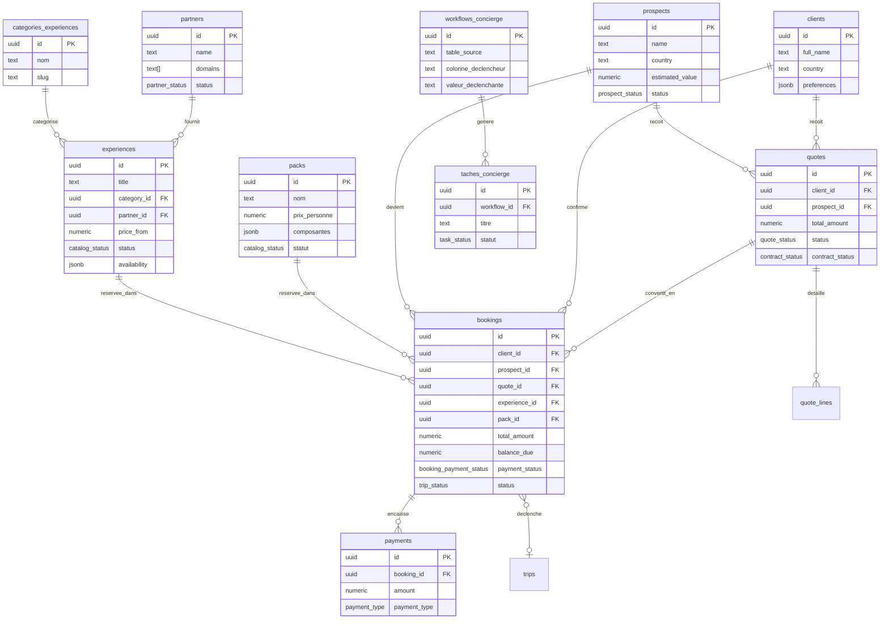
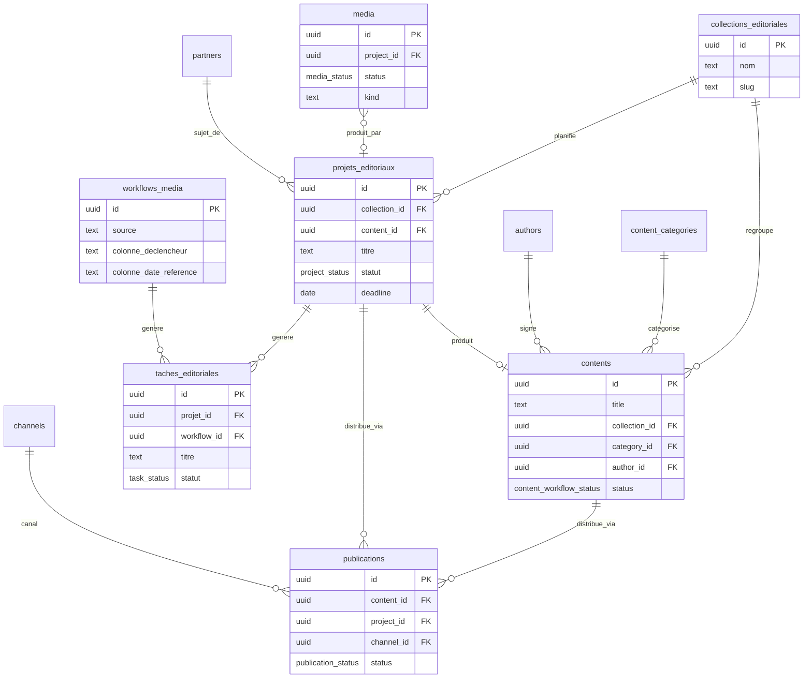

# Schéma cible — Concierge OS + Newsroom OS → Supabase (JeitinhoOS)

Conçu à partir de la structure des Sheets prototypes **Concierge OS** et
**Newsroom OS** (colonnes reprises, données non importées) et du schéma
Supabase déjà en place dans ce dépôt. Rien n'a été exécuté sur une base
de données — ce document + les fichiers `supabase/migrations/2026080312*`
sont à relire avant tout déploiement (`supabase db push` ou équivalent).

## 0. Principe directeur : étendre, pas dupliquer

Le hub a déjà 23 tables. Avant de créer quoi que ce soit, chaque
table demandée a été confrontée à l'existant. Quatre consolidations
ont été faites délibérément (détaillées plus bas, à valider) :

| Demandé | Existant réutilisé | Pourquoi |
|---|---|---|
| `articles` | `contents` (type=blog/guide) | Déjà plus riche : workflow à statuts, révisions, commentaires, SEO. Seul ajout : `collection_id`. |
| `partners_media` | `partners` + colonne `domains text[]` | Évite un doublon de fiche pour un même partenaire (ex: un hôtel qui est à la fois fournisseur concierge ET sujet d'article). |
| `distribution` | `publications` (existante) | Même concept (canal/statut/lien publié), déjà branché sur `channels`. Rendue utilisable aussi sans `contents` (ajout de `project_id`). |
| `users` | `profiles` + `user_roles` + `roles` | Système d'auth complet déjà en place ; recréer une table plate aurait fragmenté l'identité des comptes. Seul ajout : `phone`. |

Le reste (`packs`, `categories_experiences`, `bookings`, `payments`,
`workflows_concierge`, `taches_concierge`, `collections_editoriales`,
`projets_editoriaux`, `taches_editoriales`, `workflows_media`,
`localisations`, `services`) est réellement nouveau.

`leads` (déjà existante) n'a **pas** été touchée : c'est la boîte de
réception brute des formulaires publics (webhooks/`raw_payload`). Ce
que le Sheet appelle "leads" (pays, budget, relance, valeur estimée)
correspond en réalité à l'objet CRM travaillé, c'est-à-dire à
`prospects` — c'est cette table qui a été étendue.

## 1. Écarts factuels constatés

- Le brief mentionne **53 lignes** dans le Sheet Concierge OS. Le
  fichier `jeitinho/src/data/catalog.ts`, qui fait foi selon votre
  règle (jeitinho.fr = source de vérité), contient actuellement
  **39 expériences** (7 visite-rio, 6 favelas, 6 nature, 8
  rio-activités, 3 nautiques, 4 excursions, 4 excursions privées, 1
  cours) réparties sur 8 catégories. Le script de migration importe
  ce qui existe réellement dans le code, pas 53 lignes.
- La table `content_categories` du hub a été seedée (migration du
  2 août) avec 4 noms qui sont en fait des **collections** ("Les
  Quartiers", "Rio Secret", "Rio Expliqué", "Une journée à..."), pas
  les 18 vraies catégories du blog. Voir §5, risque à traiter.

## 2. Diagramme — domaine Concierge

## 3. Diagramme — domaine Média

## 4. RLS — vue d'ensemble

Règle de base demandée : **lecture publique** pour les données
destinées aux deux sites publics (expériences, packs, services,
catégories commerciales, articles publiés, catégories de blog,
collections, auteurs actifs, médias approuvés), **écriture toujours
authentifiée**. Tout le reste (CRM, devis, réservations, paiements,
partenaires, workflows, tâches) reste strictement interne, comme
aujourd'hui.

| Table | Lecture `anon` (public) | Lecture `authenticated` | Écriture |
|---|---|---|---|
| `experiences` | ✅ si `status='published'` | tous | `can_edit_content` |
| `packs` | ✅ si `statut='published'` | tous | `can_edit_content` |
| `services` | ✅ si `statut='published'` | tous | `can_edit_content` |
| `categories_experiences` | ✅ toutes | tous | `can_edit_content` |
| `localisations` | ✅ toutes | tous | `can_edit_content` |
| `contents` (articles) | ✅ si `status='published'` et `type IN (blog,guide)` | `can_edit_content` (+ auteur sur son propre contenu) | `can_edit_content` / auteur sur son brouillon |
| `content_categories` | ✅ si `'blog' = ANY(scope)` | tous | `can_edit_content` |
| `collections_editoriales` | ✅ toutes | tous | `can_edit_content` |
| `authors` | ✅ si `is_active` | tous | `can_edit_content` |
| `media` | ✅ si `status='approved'` | tous | `can_edit_content` |
| `partners` | ❌ jamais | managers + `can_edit_content` (lecture) | managers |
| `prospects` / `leads` / `clients` | ❌ jamais | managers | managers |
| `quotes` / `quote_lines` / `bookings` / `payments` | ❌ jamais | managers | managers |
| `workflows_concierge` / `workflows_media` | ❌ jamais | managers (média : lecture aussi aux éditeurs) | managers |
| `taches_concierge` / `taches_editoriales` | ❌ jamais | managers/éditeurs + responsable assigné | idem + l'assigné peut mettre à jour sa propre tâche |
| `projets_editoriaux` | ❌ jamais | `can_edit_content` | `can_edit_content` |

Point technique important : une policy RLS seule ne suffit pas — il
faut aussi le `GRANT SELECT ... TO anon` correspondant (sinon Postgres
refuse la requête avant même d'évaluer RLS). Les deux sont inclus dans
`20260803120500_shared_media_and_public_rls.sql`.

## 5. Plan de migration (étapes numérotées)

1. **Revue humaine des 6 fichiers de migration** (`supabase/migrations/2026080312*.sql`)
   avant tout déploiement — en particulier les `ALTER TYPE`/`ADD COLUMN`
   sur des tables qui ont déjà du trafic applicatif (`experiences`,
   `partners`, `quotes`, `prospects`, `contents`, `publications`, `media`).
2. **Déployer les migrations sur un environnement de staging Supabase**
   (branche de preview ou projet clone) — jamais directement en
   production. Vérifier que l'app hub actuelle continue de fonctionner
   (elle lit `is_published`, `is_active` : conservés pour compat).
3. **Nettoyer `content_categories`** : décider du sort des 4 lignes
   mal nommées (`les-quartiers`, `rio-secret`, `rio-explique`,
   `une-journee-a`) avant de les confondre avec les 18 vraies
   catégories tout juste seedées. Vérifier d'abord si des lignes
   `contents.category_id` les référencent déjà.
4. **Exécuter `scripts/migrate-experiences-from-jeitinho.ts --dry-run`**,
   vérifier le mapping catégorie par catégorie et expérience par
   expérience, PUIS relancer sans `--dry-run` en staging.
   → Résoudre au préalable le point de résolution des imports d'assets
   (`vite-node` vs export JSON intermédiaire, voir en-tête du script).
5. **Combler manuellement les champs non mappés** relevés par le
   script (`groupSize`, `priceLabel`, `transport`, `included`,
   `options`, `requiresPhysical`, `note`, `itinerary`) — absents du
   schéma `experiences` v1. Décider s'ils méritent des colonnes dédiées
   ou restent en `metadata`/`availability` jsonb.
6. **Migrer `packs` et `services`** manuellement depuis
   `packs.ts`/`services.ts` (5 packs, ~27 services) — volumes faibles,
   pas besoin de script dédié, un upsert one-off suffit.
7. **Écrire et tester les premières règles `workflows_concierge` /
   `workflows_media`** (les WF001-080 du Sheet) une par une, en
   vérifiant sur une table de test que `dispatch_concierge_workflow`/
   `dispatch_media_workflow` génèrent bien la tâche attendue, avant
   d'activer les triggers en production.
8. **Basculer les RLS publiques en dernier**, une fois les données
   migrées et validées — sinon des expériences vides ou mal formées
   deviennent visibles publiquement.
9. **Brancher jeitinho.fr / blog.jeitinho.fr en lecture** (voir §6) —
   seulement après le point 8, et en gardant le contenu actuellement
   codé en dur comme filet de secours le temps de valider en prod.
10. **Retirer progressivement `is_published`/`is_active`** une fois
    le code applicatif du hub basculé sur `status`.

## 6. Comment jeitinho.fr et blog.jeitinho.fr consomment ces données

Les deux sites sont déjà des applications **TanStack Start en SSR**
(pas des sites statiques) — leurs fonctions serveur tournent côté
serveur, jamais dans le navigateur. Cela change le calcul de risque
d'une lecture cross-projet Supabase par rapport à un site purement
statique :

- **Recommandé : lecture directe côté serveur (server functions),
  jamais côté client.** Chaque site appelle le Supabase du hub avec la
  clé `anon` **depuis sa fonction serveur** (jamais depuis le bundle
  navigateur), protégé par les RLS du §4 (lignes publiées uniquement,
  aucune colonne sensible). C'est la lecture directe demandée par le
  brief, mise en œuvre de façon à ne jamais exposer la clé anon du hub
  au navigateur des visiteurs.
- **Ajouter un cache court côté site** (quelques minutes, en mémoire
  ou Cloudflare KV/Cache API) pour amortir la latence cross-projet et
  éviter qu'une panne du hub ne devienne immédiatement une panne
  publique. Prévoir un **repli sur les données actuellement codées en
  dur** (`src/data/*.ts`) si le hub est injoignable, au moins pendant
  la période de transition.
- **Ne pas construire d'API REST/GraphQL séparée** pour ce besoin :
  PostgREST (déjà fourni par Supabase) *est* l'API — en ajouter une
  autre par-dessus n'apporterait pas de sécurité supplémentaire ici
  (le filtrage se fait déjà par RLS) pour un coût de maintenance solo
  non négligeable.

## 7. Risques et points de vigilance

- **`content_categories` contient des noms de collections, pas de
  catégories** (§1, §5.3) — à corriger avant que d'autres lignes
  `contents` ne s'y accrochent.
- **Incohérence de nommage `status` (anglais) vs `statut` (français)**
  entre tables historiques (`experiences.status`, `partners.status`)
  et nouvelles tables calquées sur les Sheets (`packs.statut`,
  `taches_*.statut`). Assumé pour ne pas casser le code applicatif
  existant qui lit déjà `is_published`/`is_active` — à harmoniser
  plus tard si souhaité.
- **Colonnes de catalog.ts sans équivalent dans `experiences`**
  (`groupSize`, `transport`, `included`, `options`, `itinerary`...) —
  perte d'information si le script de migration est lancé tel quel
  sans décision préalable sur où les loger.
- **Triggers de workflow non testés** : `dispatch_concierge_workflow`
  et `dispatch_media_workflow` sont écrits mais jamais exécutés contre
  de vraies règles — à valider avec 2-3 règles réelles avant d'activer
  plus largement (risque de tâches dupliquées ou manquantes si la
  logique de transition a un angle mort non anticipé).
- **`payments` recalcule `bookings.balance_due` par trigger** — bon
  pour éviter la dérive, mais toute correction manuelle de
  `bookings.total_amount` doit être suivie d'une ré-insertion/mise à
  jour d'un paiement (même à 0) pour redéclencher le recalcul, sinon
  `balance_due` reste basé sur l'ancien total.
- **RLS publique sur `media`** expose la liste complète des assets
  (noms de fichiers, tags, crédits photo) à quiconque a la clé anon,
  pas seulement ceux liés à un contenu publié. Alternative plus stricte
  fournie en commentaire dans la migration si jugée nécessaire.
- **Écart de comptage 53 (Sheet) vs 39 (catalog.ts réel)** — à
  confirmer que 39 est bien le nombre attendu avant de considérer la
  migration terminée (peut-être que certaines des 53 lignes du Sheet
  décrivent des expériences pas encore publiées sur le site).
- **`services` a été ajoutée par extrapolation**, absente de la
  liste Phase 2 du brief — à confirmer avant déploiement, ou à
  supprimer du jeu de migrations si non souhaitée.
